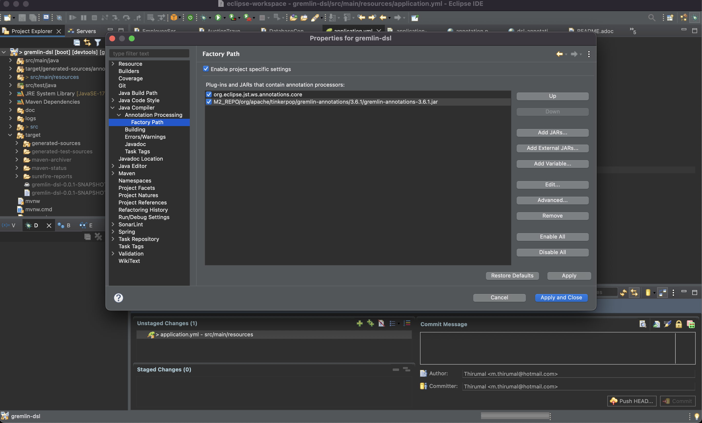
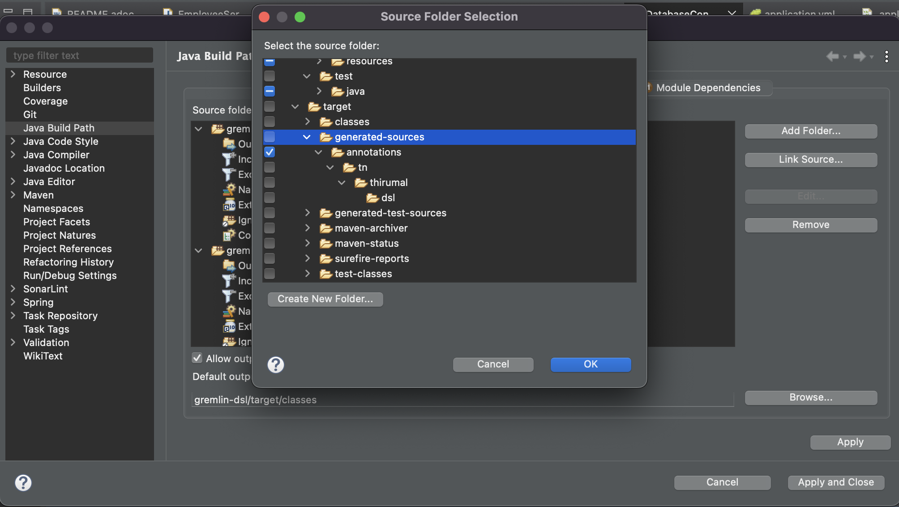

# Gremlin DSL

Gremlin DSL (Domain Specific Language) Example/Guide.

For more information refer the link: https://tinkerpop.apache.org/docs/current/reference/#dsl

Dependency required 

[source, xml]
----
<dependency>
    <groupId>org.apache.tinkerpop</groupId>
    <artifactId>gremlin-annotations</artifactId>
    <version>3.6.1</version>
</dependency>
----

== Eclipse Set up

* Import this project as `maven spring-boot` project.
* Typically, the Java compilation process is automatically configured to detect annotation processors on the classpath and will automatically use them when found. 
* If that does not happen, it may be necessary to make configuration changes to the build to allow for the compilation process to be aware of the following `javax.annotation.processing.Processor` implementation:

[source, java]
----
org.apache.tinkerpop.gremlin.process.traversal.dsl.GremlinDslProcessor
----

* The annotation processor will generate several classes for the DSL:

`SocialTraversal` - A Traversal interface that extends the SocialTraversalDsl proxying methods to its underlying interfaces (such as GraphTraversal) to instead return a SocialTraversal

`DefaultSocialTraversal` - A default implementation of SocialTraversal (typically not used directly by the user)

`SocialTraversalSource` - Spawns DefaultSocialTraversal instances.

`__` - Spawns anonymous DefaultSocialTraversal instances.

=== Annotation detection

* Right click on the project and select `properties` -> `Java compiler` -> `Annotation Processing`

	** Enable project specific settings 
	** Go to `Factory Path` and add the `jar` path in the repo.
	

==== Link Generated source to the project for eclipse

* Right click on your project > Build Path > Configure Build Path
* In sources tag, click on `[Add Folder]` button
* Check `target/generated-sources/annotations`

